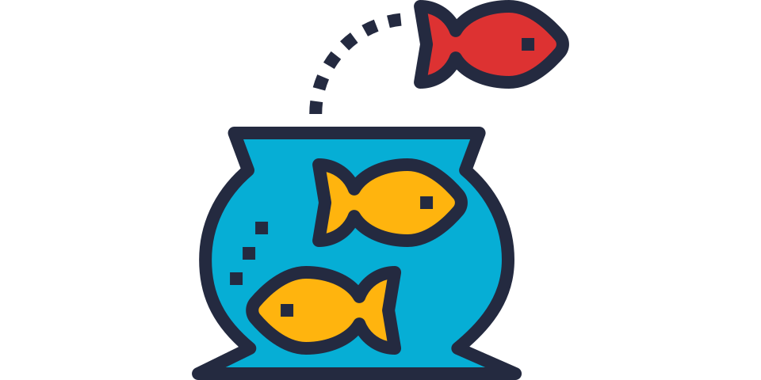

# ponyo



Ponyo is a (work-in-progress) ISA simulator currently supporting (some of) LEGv8.
It also aims to be a framework for implementing simulators for any number of ISAs.

## Simulator

- ARM LEGv8 Simulator
    - Harvard architecture
    - Takes in assembly source code
    - Takes in memory file
    - Step through program execution
    - Jump to pre-defined break points in code

### CLI

CLI for interacting with simulator. If no data memory is provided, 
a default of 256 bytes of zeros will be created.

```
$ ./ponyo/ponyo.py -f assembly_code.asm
```

Set breakpoints in the assembly by adding `//$break` on any given line.

<!-- ### TUI

TODO/CONCEPT

Optional TUI for interacting with simulator. Has a handful of components. 

- Code pane
    - Indicator of current line of code with surrounding code
- Register & flag pane
    - Shows the values of all of the registers and the flags
    - Select/copy/edit values
- Memory & stack pane
    - Scroll through the entire memory space
    - Select/copy/edit values
- Keybindings for controlling the simulator
    - S - Step to next line
    - N - Jump to next breakpoint
    - T - Toggle breakpoint
    - Q - Quit

### Library

TODO/CONCEPT

The simulator can also be integrated into another Python program as a library. -->

## Supported Architectures

### LEGv8 Harvard

33/57 instructions supported

- [x] ADD
- [x] ADDI
- [x] ADDS
- [x] ADDIS

- [x] AND
- [x] ANDI
- [x] ANDS
- [x] ANDIS

- [x] B
- [X] B.COND
- [X] BL
- [X] BR
- [x] CBNZ
- [x] CBZ

- [x] EOR
- [x] EORI

- [x] LDUR
- [X] LDURB
- [X] LDURH
- [ ] LDURSW
- [ ] LDXR

- [x] LSL
- [x] LSR

- [ ] MOVK
- [ ] MOVZ

- [x] ORR
- [x] ORRI

- [x] STUR
- [X] STURB
- [X] STURH
- [ ] STURSW
- [ ] STXR

- [x] SUB
- [x] SUBI
- [x] SUBS
- [x] SUBIS

- [ ] FADDS
- [ ] FADDD
- [ ] FCMPS
- [ ] FCMPD
- [ ] FDIVS
- [ ] FDIVD
- [ ] FMULS
- [ ] FMULD
- [ ] FSUBS
- [ ] FSUBD

- [ ] LDURS
- [ ] LDURD
- [ ] MUL
- [ ] SDIV
- [ ] SMULH
- [ ] UDIV
- [ ] UMULH

- [x] CMP
- [x] CMPI
- [ ] LDA
- [x] MOV

<br>
<a href="https://www.flaticon.com/free-icons/fishbowl" title="fishbowl icons">Fishbowl icon created by Becris - Flaticon</a>