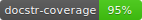
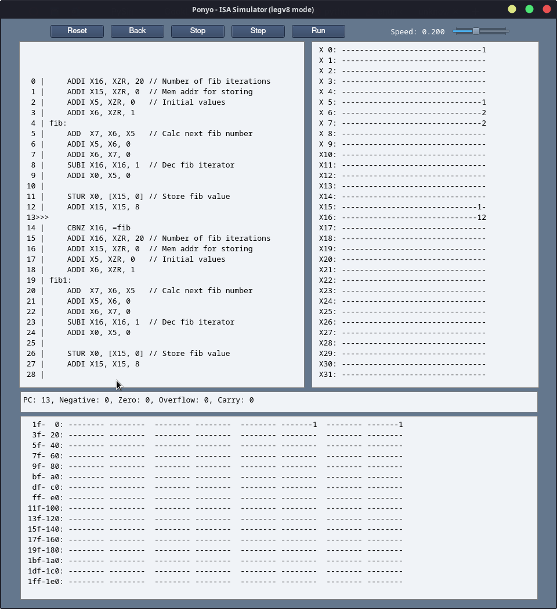

# ponyo




Ponyo is a (work-in-progress) ISA simulator currently supporting (some of) LEGv8.
It also aims to be a framework for implementing simulators for any number of ISAs.

A blog post describing the initial development of this project is on my blog [here](https://blog.eowyn.net/ponyo_blog/).

## Simulator

- ARM LEGv8 Simulator
    - Harvard architecture
    - Takes in assembly source code
    - Takes in memory file
    - Step through program execution
    - Jump to pre-defined break points in code

### CLI

```
usage: ponyo [-h] -f ASM [-d MEM] [--isa ISA] [--debug] [--gui]

options:
  -h, --help         show this help message and exit
  -f ASM, --asm ASM  Assembly file
  -d MEM, --mem MEM  Data memory file
  --isa ISA          ISA of assembly file
  --debug
  --gui
```

Execute directly:

```
$ ./ponyo/ponyo.py -f examples/legv8/fib.asm --debug
```

Install using pip:
```
$ git clone https://github.com/nobodywasishere/ponyo
$ cd ponyo
$ pip install .
...
$ ponyo -f examples/legv8/fib.asm --gui
```

Set breakpoints in the assembly by adding `//$break` on any given line.

### GUI

Simply run `ponyo` with the `--gui` flag and the assembly file you wish to run.



<!-- ### TUI

TODO/CONCEPT

Optional TUI for interacting with simulator. Has a handful of components. 

- Code pane
    - Indicator of current line of code with surrounding code
- Register & flag pane
    - Shows the values of all of the registers and the flags
    - Select/copy/edit values
- Memory & stack pane
    - Scroll through the entire memory space
    - Select/copy/edit values
- Keybindings for controlling the simulator
    - S - Step to next line
    - N - Jump to next breakpoint
    - T - Toggle breakpoint
    - Q - Quit

### Library

TODO/CONCEPT

The simulator can also be integrated into another Python program as a library. -->

<br><hr><br>

## Supported Architectures

### LEGv8 Harvard

33/57 instructions supported

- [x] ADD, ADDI, ADDS, ADDIS
- [x] AND, ANDI, ANDS, ANDIS
- [x] B, B.COND, BL, BR, CBNZ, CBZ
- [x] EOR, EORI
- [x] LDUR, LDURB, LDURH
- [ ] LDURSW, LDXR
- [x] LSL, LSR
- [ ] MOVK, MOVZ
- [x] ORR, ORRI
- [x] STUR, STURB, STURH
- [ ] STURSW, STXR

- [x] SUB, SUBI, SUBS, SUBIS

- [ ] FADDS, FADDD, FCMPS, FCMPD, FDIVS, FDIVD, FMULS, FMULD, FSUBS, FSUBD

- [ ] LDURS, LDURD, MUL, SDIV, SMULH, UDIV, UMULH

- [x] CMP, CMPI, MOV
- [ ] LDA

### [EccCPU](https://blog.eowyn.net/EccCPU/)

13/13 instructions supported


<br><hr><br>
<a href="https://www.flaticon.com/free-icons/fishbowl" title="fishbowl icons">Fishbowl icon created by Becris - Flaticon</a>